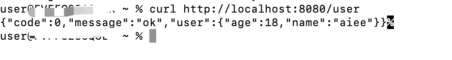
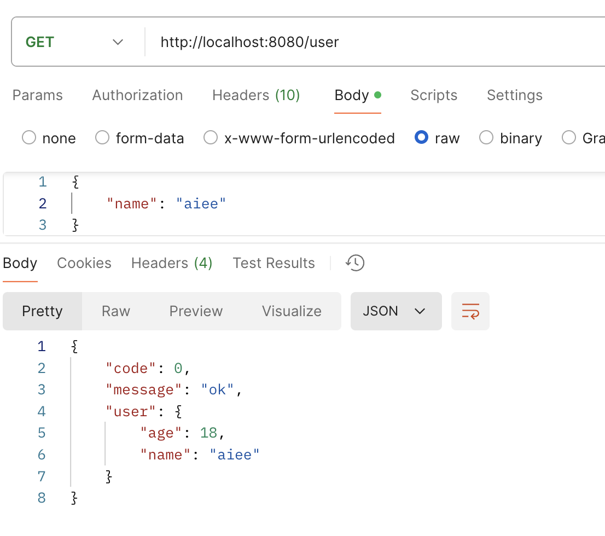

# github.com/liyonge-cm/mock

通过json定义接口的mock服务。

通过json定义mock接口，无需开发代码，即可启动 mock api，且可以调用。
json规则也非常简单，只需要定义接口路径、请求方式，入参和出参，其中入参可以不定义，只是一个展示作用

用法：
在项目的json文件夹下创建自己的json接口文件，只需要定义几个字段即可启动接口
- router 接口路径
- method 接口请求方式：get,post,put,delete
- request 接口请求参数
- response 接口返回参数


例如，在json下创建user.json，内容为：
```json
{
    "router": "/user",
    "method": "get",
    "request": {
        "name": "aiee"
    },
    "response": {
        "code": 0,
        "message": "ok",
        "user": {
            "name": "aiee",
            "age": 18
        }
    }
}
```

启动项目：
```shell
go run main.go
```


即可调用API，服务端口号：8080

```shell
curl http://localhost:8080/user
``` 


或者用postman等接口调试工具
